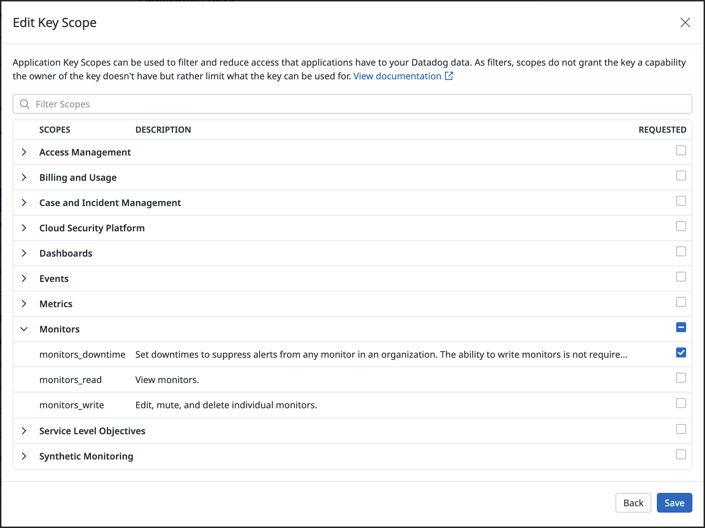

# Datadog downtime action

This action allows you to create a downtime in Datadog. This is useful for example when you want to schedule a maintenance window for your application during a deployment.

## Authentication

In order to use this action, you need to provide your Datadog API and application keys as secrets.

The application key needs the `monitors_downtime` permission.



## Usage

### Basic

Create a downtime for 5 minutes that will affect all monitors in your Datadog account.

```yaml
- uses: brookke/datadog-downtime-action@v1
  with:
    downtime-minutes: 5
    api-key: ${{ secrets.DATADOG_API_KEY }}
    app-key: ${{ secrets.DATADOG_APP_KEY }}
```

### Disable a specific monitor

Create a downtime for 5 minutes that will affect only the monitor with the ID `123456`.

The monitor ID can be found in the URL of the monitor in Datadog, for example `https://app.datadoghq.com/monitors/123456`.

```yaml
- uses: brookke/datadog-downtime-action@v1
  with:
    downtime-minutes: 5
    monitor-id: 123456
    api-key: ${{ secrets.DATADOG_API_KEY }}
    app-key: ${{ secrets.DATADOG_APP_KEY }}
```

### Disable monitors by tag(s)

Create a downtime for 5 minutes that will affect only the monitors with the tag `ignore-during-deploy`.

For more information about monitor tags, see the [Datadog downtime documentation](https://docs.datadoghq.com/monitors/notify/downtimes/?tab=bymonitortags#choose-what-to-silence).

```yaml
- uses: brookke/datadog-downtime-action@v1
  with:
    downtime-minutes: 5
    monitor-tags: '["ignore-during-deploy"]'
    api-key: ${{ secrets.DATADOG_API_KEY }}
    app-key: ${{ secrets.DATADOG_APP_KEY }}
```

You can also use multiple tags to create a downtime for multiple monitors.
e.g. `monitor-tags: '["ignore-during-deploy", "ignore-during-deploy-2"]'`

or you can require a monitor to have multiple tags e.g. `monitor-tags: '["ignore-during-deploy-2,env:prod"]'`

### Disable monitors by scope(s)

Create a downtime for 5 minutes that will affect only sources with the scope `env:prod`.

For more information about scopes, see the [Datadog downtime documentation](https://docs.datadoghq.com/monitors/notify/downtimes/?tab=bymonitorname#downtime-scope).

```yaml
- uses: brookke/datadog-downtime-action@v1
  with:
    downtime-minutes: 5
    scope: '["env:prod"]'
    api-key: ${{ secrets.DATADOG_API_KEY }}
    app-key: ${{ secrets.DATADOG_APP_KEY }}
```

### Provide a custom downtime message

Create a downtime for 5 minutes that will affect all monitors in your Datadog account and will have the message `Maintenance window - @username` which will notify the user `username` via Datadog.

Notifications can be sent to specific users by using the `@username` notation, see the [Datadog downtime API documentation](https://docs.datadoghq.com/api/latest/downtimes/?code-lang=typescript#schedule-a-downtime) for more information.

```yaml
- uses: brookke/datadog-downtime-action@v1
  with:
    downtime-minutes: 5
    message: 'Maintenance window - @username'
    api-key: ${{ secrets.DATADOG_API_KEY }}
    app-key: ${{ secrets.DATADOG_APP_KEY }}
```
